# TicketSystem — Sistema de Gestión de Eventos y Entradas

Aplicación web full-stack tipo Ticketek para la compra, cancelación y transferencia de entradas a eventos con selección de asientos. Desarrollada con **Go (Gin + GORM)** en el backend y **React (Vite)** en el frontend, contenedorizada con **Docker Compose**.

---

## Tabla de Contenidos

1. [Capturas de pantalla](#capturas-de-pantalla)
2. [Tecnologías utilizadas](#tecnologías-utilizadas)
3. [Requisitos previos](#requisitos-previos)
4. [Instalación y uso — Local](#instalación-y-uso--local)
5. [Instalación y uso — Docker](#instalación-y-uso--docker)
6. [Endpoints de la API](#endpoints-de-la-api)
7. [Tests y Cobertura](#tests-y-cobertura)
8. [Diagrama de Base de Datos](#diagrama-de-base-de-datos)
9. [Decisiones de Diseño](#decisiones-de-diseño)
10. [Funcionalidad Extra — Bonus Track](#funcionalidad-extra--bonus-track)
11. [Integrantes](#integrantes)

---

## Capturas de pantalla

### Catálogo de Eventos
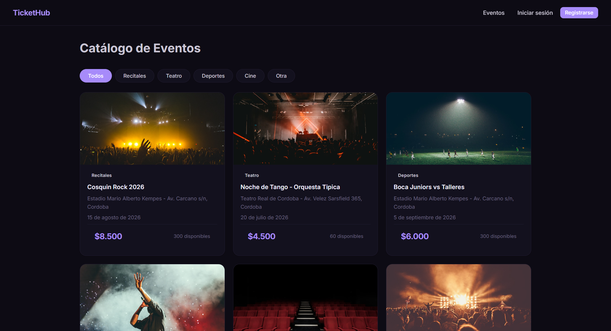

### Filtro por Categoría
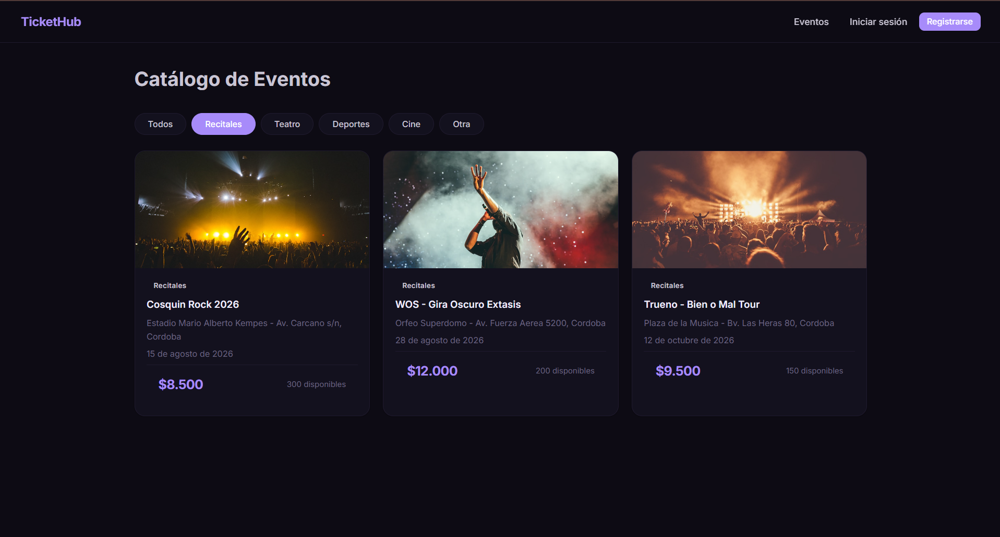

### Login y Registro
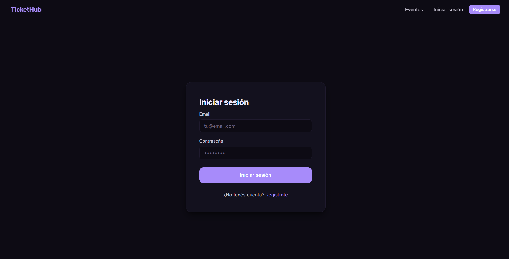
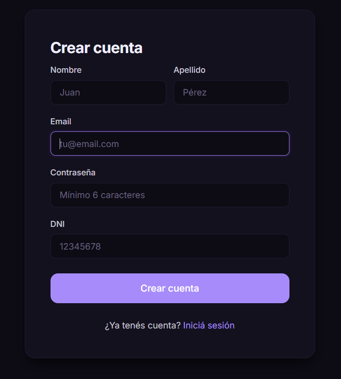

### Detalle de Evento
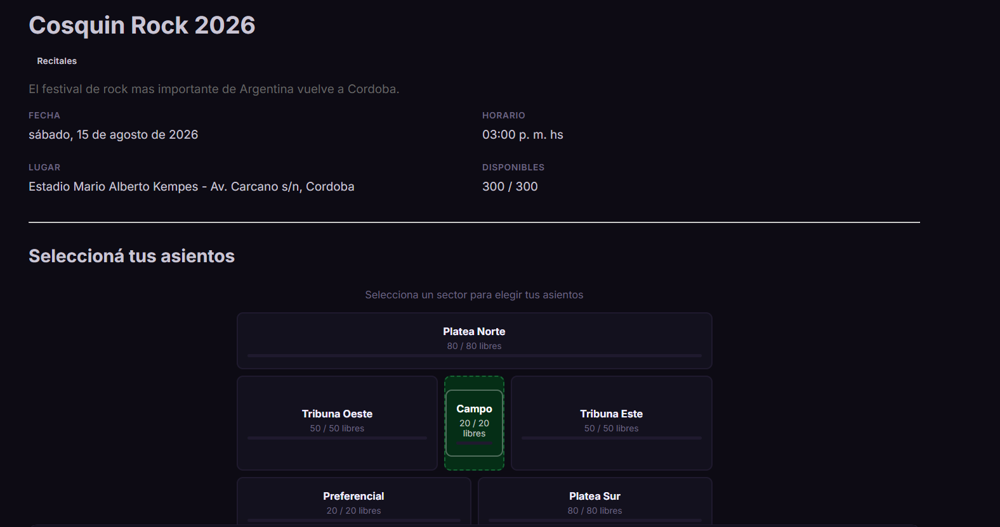

### Mapa de Asientos — Vista Estadio
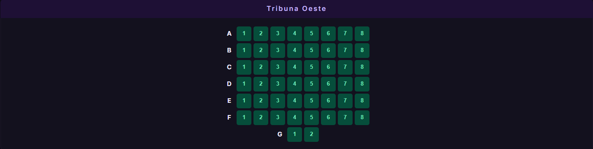

### Mapa de Asientos — Vista Sector
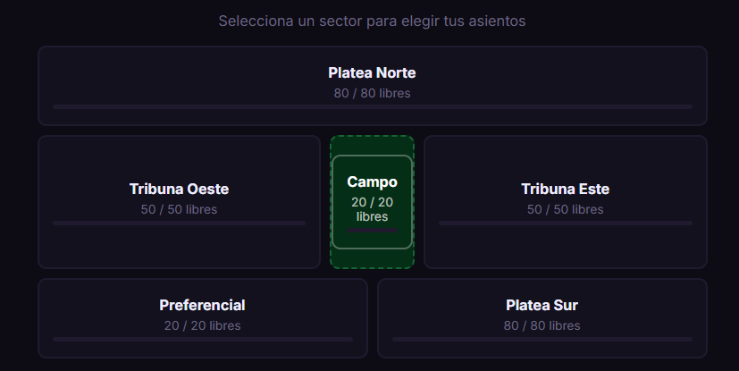

### Compra Exitosa
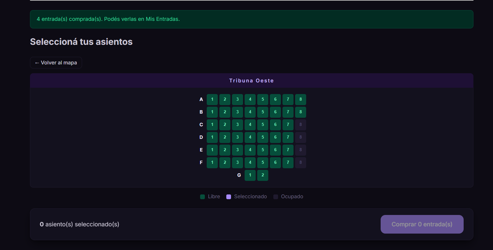

### Mis Entradas
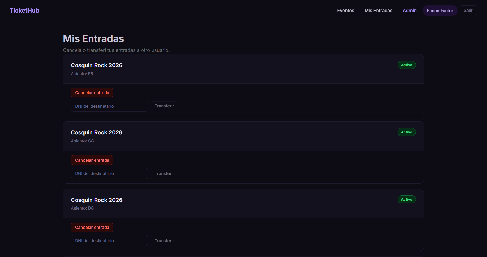

### Panel Admin — Eventos
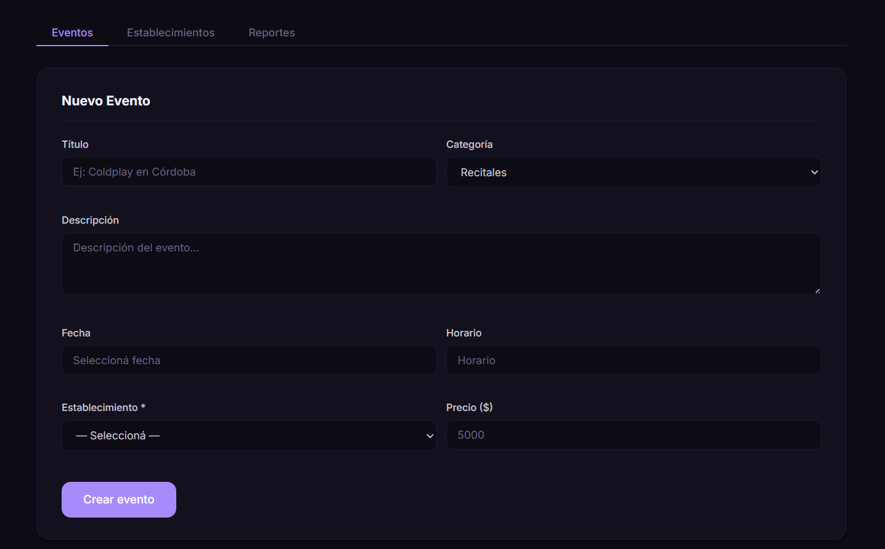

### Panel Admin — Establecimientos
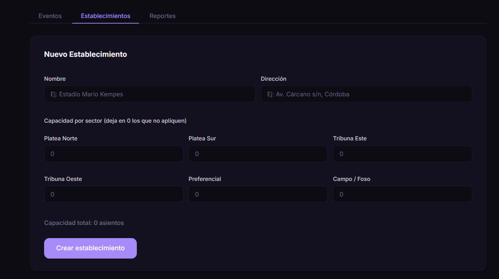

### Panel Admin — Reportes
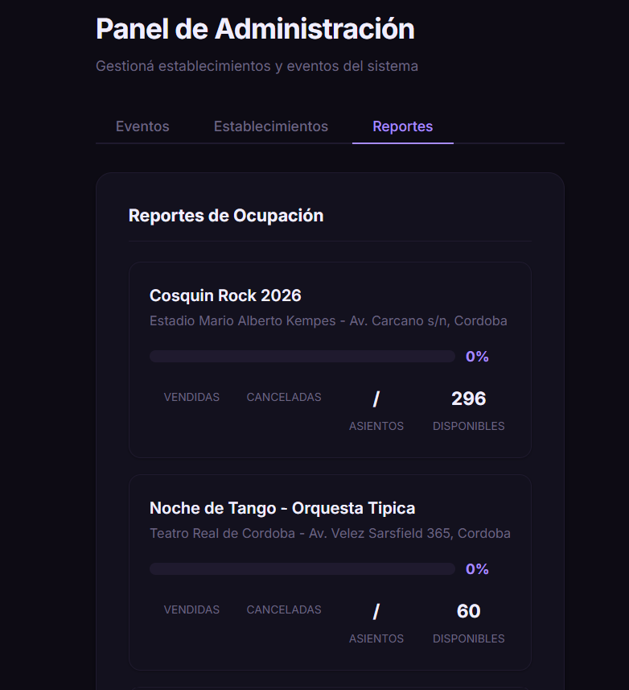

---

## Tecnologías utilizadas

### Backend
| Tecnología | Uso |
|---|---|
| Go 1.21+ | Lenguaje principal del servidor |
| Gin | Framework HTTP y enrutamiento |
| GORM | ORM para MySQL |
| golang-jwt/jwt | Generación y validación de tokens JWT |
| MySQL 8.0 | Base de datos relacional |

### Frontend
| Tecnología | Uso |
|---|---|
| React 18 | Biblioteca de UI |
| Vite | Bundler y servidor de desarrollo |
| React Router DOM | Navegación entre vistas |
| Axios | Cliente HTTP para consumir la API |
| react-datepicker | Selector de fecha/hora en formularios de admin |

### DevOps
| Tecnología | Uso |
|---|---|
| Docker | Contenedorización de servicios |
| Docker Compose | Orquestación de backend, frontend y base de datos |

---

## Requisitos previos

### Para ejecución local (sin Docker)

| Herramienta | Versión mínima |
|---|---|
| Go | 1.21+ |
| Node.js | 18+ |
| MySQL | 8.0+ |
| Git | cualquiera |

### Para ejecución con Docker

| Herramienta | Versión mínima |
|---|---|
| Docker Desktop | 4.0+ |
| Git | cualquiera |

---

## Instalación y uso — Local

### Backend

#### 1. Crear la base de datos en MySQL

```sql
CREATE DATABASE ticket_system CHARACTER SET utf8mb4 COLLATE utf8mb4_unicode_ci;
```

> Las tablas se crean automáticamente al iniciar el backend gracias a **GORM AutoMigrate**.

#### 2. Configurar variables de entorno

```bash
cd Backend
cp .env.example .env
```

Editar `.env` con los datos reales:

```env
DB_USER=root
DB_PASSWORD=tu_password
DB_HOST=127.0.0.1
DB_PORT=3306
DB_NAME=ticket_system
JWT_SECRET=una_clave_secreta_larga_y_segura
```

> `.env` está en `.gitignore` y nunca debe commitearse.

#### 3. Instalar dependencias e iniciar

```bash
go mod tidy
go run main.go
```

El servidor queda escuchando en `http://localhost:8080`.

#### 4. (Opcional) Cargar datos de prueba

```bash
mysql -u root -p ticket_system < database/seed.sql
```

Carga 5 establecimientos, 8 eventos y 1410 asientos distribuidos por sector.

---

### Frontend

#### 1. Instalar dependencias

```bash
cd Frontend
npm install
```

#### 2. Ejecutar en modo desarrollo

```bash
npm run dev
```

La app queda disponible en `http://localhost:5173`.

---

## Instalación y uso — Docker

> Forma recomendada: levanta backend, frontend y base de datos en un solo comando.

### 1. Levantar los contenedores

```bash
docker-compose up --build
```

Los servicios quedan disponibles en:
- Frontend: `http://localhost:5173`
- Backend API: `http://localhost:8080`
- MySQL: `localhost:3306`

### 2. Cargar datos de prueba en Docker

Una vez que los contenedores estén corriendo, en una terminal separada:

```bash
Get-Content ".\Backend\database\seed.sql" | docker exec -i dws_mysql_db mysql -uroot -proot dws_proyecto
```

En Linux/Mac:
```bash
docker exec -i dws_mysql_db mysql -uroot -proot dws_proyecto < Backend/database/seed.sql
```

### 3. Bajar los contenedores

```bash
docker-compose down
```

Para eliminar también los datos de la base:
```bash
docker-compose down -v
```

---

## Endpoints de la API

**Base URL:** `http://localhost:8080/api`

### Públicos (sin autenticación)

| Método | Ruta | Descripción |
|---|---|---|
| POST | `/auth/register` | Registrar nuevo usuario |
| POST | `/auth/login` | Login — devuelve token JWT |
| GET | `/events` | Listar eventos (acepta `?category=Recitales`) |
| GET | `/events/:id` | Detalle completo de un evento |
| GET | `/events/:id/seats` | Asientos del evento con estado libre/ocupado |
| GET | `/venues` | Listar establecimientos |
| GET | `/venues/:id` | Detalle de un establecimiento |

### Protegidos — Cliente (requieren `Authorization: Bearer <token>`)

| Método | Ruta | Descripción |
|---|---|---|
| POST | `/tickets/purchase` | Comprar entradas con selección de asientos |
| GET | `/tickets/my-tickets` | Historial de entradas del usuario |
| POST | `/tickets/:id/cancel` | Cancelar una entrada activa |
| POST | `/tickets/:id/transfer` | Transferir entrada por DNI del destinatario |

### Protegidos — Administrador (requieren token con `rol: admin`)

| Método | Ruta | Descripción |
|---|---|---|
| POST | `/admin/events` | Crear nuevo evento |
| PUT | `/admin/events/:id` | Actualizar datos de un evento |
| DELETE | `/admin/events/:id` | Eliminar un evento |
| GET | `/admin/events/:id/report` | Reporte de ocupación y ventas del evento |
| POST | `/admin/venues` | Crear nuevo establecimiento |
| PUT | `/admin/venues/:id` | Actualizar establecimiento |
| DELETE | `/admin/venues/:id` | Eliminar establecimiento |

---

## Tests y Cobertura

Ejecutar desde la carpeta `Backend/`:

```bash
cd Backend
```

### Correr todos los tests

```bash
go test ./... -v
```

### Ver cobertura total

```bash
go test ./... -coverprofile=coverage.out
go tool cover -func coverage.out
```

### Ver cobertura en el navegador (HTML interactivo)

```bash
go tool cover -html=coverage.out
```

> Cobertura actual: **80.7%** sobre servicios, controladores y middlewares (175 tests).

---

## Diagrama de Base de Datos

> El diagrama se encuentra en [`/docs/db-diagram.png`](./docs/db-diagram.png).

<!-- Insertar imagen aquí cuando esté disponible -->

El modelo incluye las siguientes entidades principales:

- **users** — Clientes y administradores del sistema
- **venues** — Establecimientos con capacidad por sector (Platea Norte/Sur, Tribuna Este/Oeste, Preferencial, Campo)
- **events** — Eventos vinculados obligatoriamente a un establecimiento (`venue_id`)
- **seats** — Asientos individuales por evento, sector, fila y número
- **tickets** — Entradas adquiridas por un usuario para un evento y asiento específico

---

## Decisiones de Diseño

### 1. Bloqueo pesimista (Pessimistic Locking) para evitar sobreventa

En escenarios de alta concurrencia, varios usuarios podrían intentar comprar el último asiento simultáneamente. Para evitar esto se utiliza `SELECT ... FOR UPDATE` mediante GORM dentro de una transacción:

```go
tx.Clauses(clause.Locking{Strength: "UPDATE"}).
    Where("id IN ?", seatIDs).
    Find(&seats)
```

Esto bloquea las filas de los asientos seleccionados a nivel de base de datos hasta que la transacción se confirma o revierte, garantizando que dos compras concurrentes nunca puedan asignar el mismo asiento.

### 2. Eliminación en cascada de eventos y asientos

Al eliminar un evento, todos sus asientos (`seats`) se eliminan automáticamente gracias a la constraint `OnDelete:CASCADE` definida en el modelo GORM:

```go
Event *Event `gorm:"foreignKey:EventID;constraint:OnDelete:CASCADE;"`
```

Esto evita registros huérfanos en la base de datos sin requerir lógica extra en el servicio. Para los tickets, en cambio, se usa `OnDelete:RESTRICT` para impedir eliminar eventos que ya tienen entradas vendidas, protegiendo la integridad del historial del usuario.

### 3. Hashing de contraseñas con SHA-256

Las contraseñas se almacenan como hash hexadecimal SHA-256, nunca en texto plano. La función es determinista y sin sal, lo que permite verificar credenciales sin almacenar la contraseña original y es compatible con el requisito del enunciado (MD5 o SHA256).

---

## Funcionalidad Extra — Bonus Track

### Selección de Asientos con Mapa Interactivo

Al comprar una entrada, el cliente puede visualizar y seleccionar asientos individuales a través de un mapa interactivo del establecimiento:

- **Vista estadio**: muestra los sectores del venue (Platea Norte/Sur, Tribunas, Preferencial, Campo) con su ocupación en tiempo real.
- **Vista de sector**: al hacer clic en un sector, se despliega la grilla de filas y asientos con indicación de libre / seleccionado / ocupado.
- **Consistencia garantizada**: la cantidad de tickets generados siempre coincide con la cantidad de asientos seleccionados. Cada asiento se marca como `ocupado = true` en la misma transacción atómica que crea los tickets.
- **Prevención de duplicados**: se usa bloqueo pesimista en la consulta de asientos para evitar que dos usuarios seleccionen el mismo asiento en simultáneo.

---

## Integrantes

| Nombre | Legajo | Rol principal |
|---|---|---|
| Simón Factor | 2408192 | Backend — Auth, Middlewares, Testing |
| Juan Scaglia | 2413770 | Backend — Tickets, Transacciones, Servicios |
| Facundo Arribillaga | 2411006 | Frontend — Vistas, Componentes, Consumo de API |
