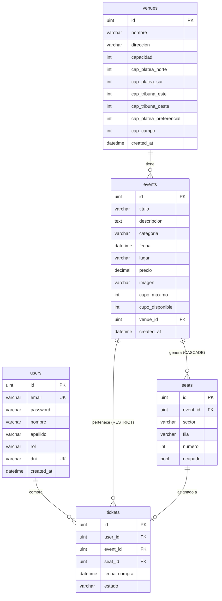

```mermaid
erDiagram
    users {
        uint id PK
        varchar email UK
        varchar password
        varchar nombre
        varchar apellido
        varchar rol
        varchar dni UK
        datetime created_at
    }

    venues {
        uint id PK
        varchar nombre
        varchar direccion
        int capacidad
        int cap_platea_norte
        int cap_platea_sur
        int cap_tribuna_este
        int cap_tribuna_oeste
        int cap_platea_preferencial
        int cap_campo
        datetime created_at
    }

    events {
        uint id PK
        varchar titulo
        text descripcion
        varchar categoria
        datetime fecha
        varchar lugar
        decimal precio
        varchar imagen
        int cupo_maximo
        int cupo_disponible
        uint venue_id FK
        datetime created_at
    }

    seats {
        uint id PK
        uint event_id FK
        varchar sector
        varchar fila
        int numero
        bool ocupado
    }

    tickets {
        uint id PK
        uint user_id FK
        uint event_id FK
        uint seat_id FK
        datetime fecha_compra
        varchar estado
    }

    venues ||--o{ events : "tiene"
    events ||--o{ seats : "genera (CASCADE)"
    users ||--o{ tickets : "compra"
    events ||--o{ tickets : "pertenece (RESTRICT)"
    seats ||--o| tickets : "asignado a"
```
